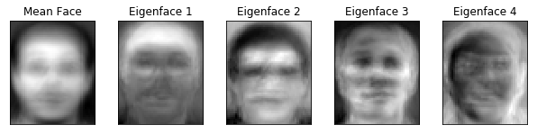
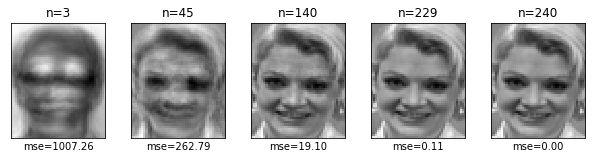
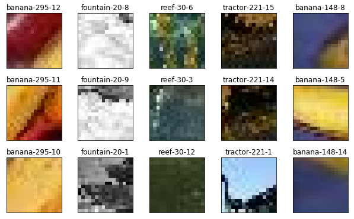
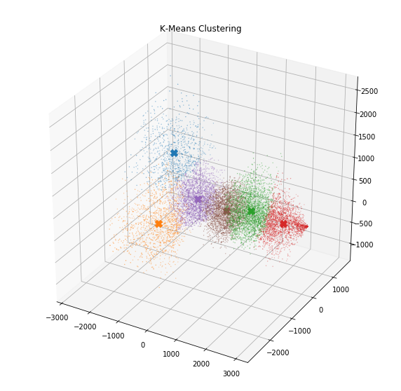
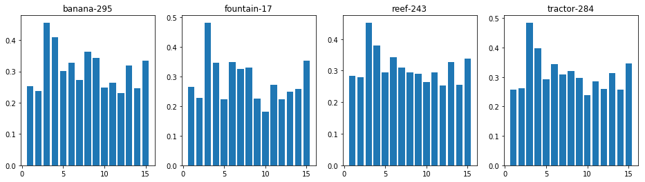
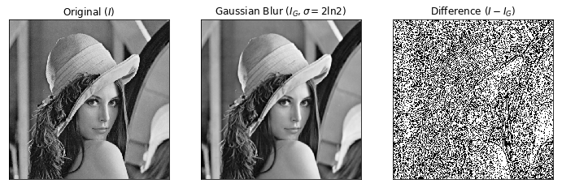
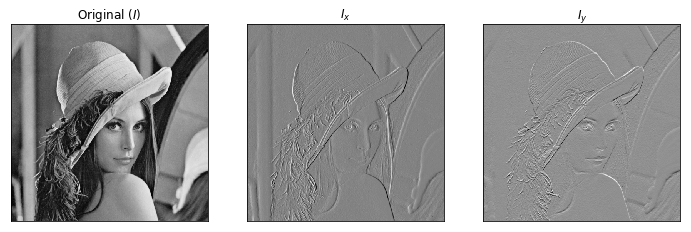
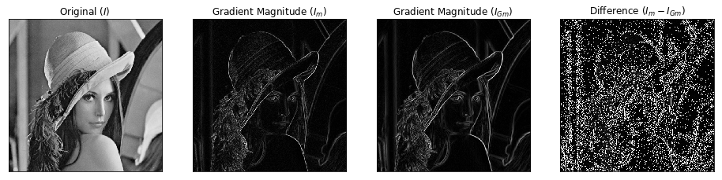

# DLCV Homework 1

* R07944007 林良翰

## 1. Bayes Decision Rule

* Find Best $T$

  $\begin{matrix}  & \min\limits _{ 2\le T\le 5 }{ \int _{ T }^{ \infty  }{ P\left( x|{ w }_{ 1 } \right) P\left( { w }_{ 1 } \right) dx } +\int _{ -\infty  }^{ T }{ P\left( x|{ w }_{ 2 } \right) P\left( { w }_{ 2 } \right) dx }  }  \end{matrix}$
  
  $ \begin{matrix} = & \min\limits _{ 2\le T\le 5 }{ \frac { 2 }{ 9 } \int _{ T }^{ \infty  }{ P\left( x|{ w }_{ 1 } \right) dx } +\frac { 7 }{ 9 } \int _{ -\infty  }^{ T }{ P\left( x|{ w }_{ 2 } \right) dx }  }  \end{matrix}$
  
  $ \begin{matrix} = & \min\limits _{ 2\le T\le 5 }{ \frac { 2 }{ 9 } \left[ \frac { 1 }{ 5 } \left( 5-T \right)  \right] +\frac { 7 }{ 9 } \left[ \frac { 1 }{ 7 } \left( T-2 \right)  \right]  }  \end{matrix}$
  
  $ \begin{matrix} = & \min\limits _{ 2\le T\le 5 }{ \frac { T }{ 15 }  }  \end{matrix}$
  
  $ \Rightarrow T=2,{ P }_{ e }=\frac { 2 }{ 15 }$
  
* Dicision Regions  

  $R_1$ : $x\lt 2$  
  
  $R_2$ : $x\ge 2$
  
## 2. PCA for Eigenfaces

* Reference: 
  * https://sandipanweb.wordpress.com/2018/01/06/eigenfaces-and-a-simple-face-detector-with-pca-svd-in-python/ 

### 2.1.

### 2.2. 2.3.

### 2.4.

* Accuracy

|   -   |  k=1   |  k=3   |  k=5   |
| :---: | :----: | :----: | :----: |
| n=3   | 0.6792 | 0.5958 | 0.5208 |
| n=45  | 0.9292 | 0.8333 | 0.7833 |
| n=140 | 0.9333 | 0.8542 | 0.7583 |

* Best $\left(n,k\right)=\left(140,1\right)$

### 2.5.

* Test accuracy = $93.75\%$

## 3.

### 3.1.

* I can't classify an image by seeing just a few patches, because there are some patches that are similar but with different classes.

### 3.2.

### 3.3.

### 3.4.

* Test accuracy = $53.8\%$

## 4. Image Filtering

### 4.1.

$G\left( x \right) =\frac { 1 }{ \sqrt { 2\pi { \sigma  }^{ 2 } }  } { e }^{ -\frac { { x }^{ 2 } }{ 2{ \sigma  }^{ 2 } }  }$

$G\left( y \right) =\frac { 1 }{ \sqrt { 2\pi { \sigma  }^{ 2 } }  } { e }^{ -\frac { y^{ 2 } }{ 2{ \sigma  }^{ 2 } }  }$

$G\left( x \right) G\left( y \right) =\frac { 1 }{ { \left( \sqrt { 2\pi { \sigma  }^{ 2 } }  \right)  }^{ 2 } } { e }^{ -\frac { { x }^{ 2 } }{ 2{ \sigma  }^{ 2 } } -\frac { { y }^{ 2 } }{ 2{ \sigma  }^{ 2 } }  }=\frac { 1 }{ 2\pi { \sigma  }^{ 2 } } { e }^{ -\frac { { x }^{ 2 }+{ y }^{ 2 } }{ 2{ \sigma  }^{ 2 } }  }=G\left( x,y \right)$

### 4.2.

* The filtered image is smoother.

### 4.3.

* ${ k }_{ x }=\frac { 1 }{ 2 } \begin{bmatrix} 0 & 0 & 0 \\ -1 & 0 & +1 \\ 0 & 0 & 0 \end{bmatrix}$

* ${ k }_{ y }=\frac { 1 }{ 2 } \begin{bmatrix} 0 & -1 & 0 \\ 0 & 0 & 0 \\ 0 & +1 & 0 \end{bmatrix}$

### 4.4.

* The Gaussian-blurred image has less gradient magnitude than original image.